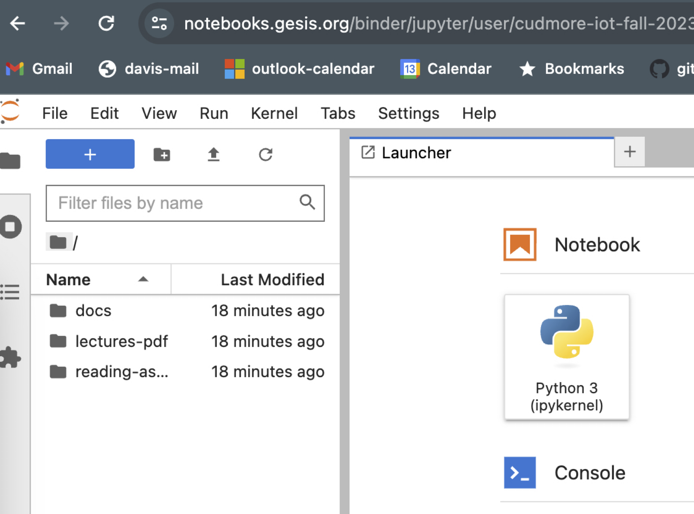

## Running Jupyter notebooks interactively online

Go to [https://mybinder.org/](https://mybinder.org/).

Enter the url for our iot class:

```
https://github.com/cudmore/iot-fall-2023
```

Wait a bit and you will get an interface like this

